# NIGHTGLASS — Threat Constellation

A self-hosted, single-file cyber threat analysis platform. Ingest heterogeneous threat data (JSON / STIX-lite / CSV / raw text), visualize it as an interactive force-directed **threat constellation**, run **automatic ingest pipelines** with translation, and fire **alerts from saved searches**. **Classification markings with clearance-based redaction and custom tagging** are built in as an opt-in advanced mode — off by default for a clean view, one toggle away when you need them. Zero build step, zero dependencies — open `index.html` and it works.

## Quick start

```powershell
# just open it
start .\index.html
# or serve it (avoids any file:// quirks)
python -m http.server 8080
# or containerized
docker compose up --build
```

Or try the [live demo](https://kingkag3.github.io/NightGlass/) — no install required.

The app boots into the fictional **Operation Nightjar** demo campaign so every feature has data on first launch.

**Want a bigger example to explore?** Download [`docs/samples/the-americans-network.json`](docs/samples/the-americans-network.json) — a denser fictional dataset (60 entities, 101 links, 42 relation types: a HUMINT network graph based on FX's *The Americans*) — and drag it into the Ingest view. Works the same way on the [live demo](https://kingkag3.github.io/NightGlass/) as it does locally; nothing is uploaded anywhere, the file is read entirely in your browser. It's also a good showcase for relationship-line coloring and the multi-actor focus panel, since it loads alongside Operation Nightjar as a second, unconnected actor network.

There's also [`docs/samples/the-wire-network.json`](docs/samples/the-wire-network.json) — a Baltimore narcotics-trafficking network based on HBO's *The Wire* (48 entities, 84 links, 39 threat actors organized under **The Barksdale Organization** campaign), covering a full organizational hierarchy, a rival stick-up crew, the Major Crimes Unit investigating them, and a rising rival organization. Good for exercising the Threat Actors view's Groups/Actors split and group-filtered constellation focus on a dataset with real depth.

[`docs/samples/the-sopranos-network.json`](docs/samples/the-sopranos-network.json) is the same idea for HBO's *The Sopranos* (43 entities, 77 links) — the DiMeo crime family's internal succession disputes, FBI informants, and a full-blown war with the rival Lupertazzi family.

And [`docs/samples/solarwinds-network.json`](docs/samples/solarwinds-network.json) is the odd one out: **real-world, not fictional.** It models the actual SUNBURST/SolarWinds Orion supply chain compromise (APT29/Cozy Bear, attributed by the U.S. Government to Russia's SVR), compiled from public FireEye/Mandiant, Microsoft MSTIC, CrowdStrike, Volexity, and CISA reporting — 41 entities, 67 links, and the only sample that touches every entity type (campaign, actor, malware, technique, CVE, and target asset) in one dataset.

## Features

- **Threat constellation** — custom canvas force-directed graph: type-colored nodes, severity rings, traveling signal pulses, drag/pan/zoom, query filtering, per-type legend toggles, and an inspector drawer for pivoting relationship-by-relationship.
- **Command center** — composite risk gauge, security posture, severity distribution, live activity feed, top actors, indicator-type breakdown.
- **Multi-format ingestion** — native JSON graphs, STIX-lite bundles, CSV IOC lists with header inference, and a regex miner for raw text (IPv4, domains, URLs, hashes, CVEs, emails — defanged indicators are re-fanged automatically).
- **Automatic pipelines** — polling sources with per-pipeline classification, auto-tagging, and translation; a built-in simulator feed for demos plus URL polling for real feeds (point at a CORS-enabled relay or your own FastAPI proxy).
- **Auto-translation** — pluggable provider: a LibreTranslate-compatible endpoint for self-hosting, or an offline demo dictionary.
- **Classification & redaction (opt-in advanced mode)** — off by default; one toggle in Pipelines & Settings reveals U / CUI / SECRET / TOP SECRET markings with a proper banner bar, set per instance, per ingest batch, or per item, plus the custom tag editor. Content above the active analyst's clearance renders blurred/redacted everywhere (graph, feed, timeline, matrix, search, inspector).
- **Custom tagging** — free-form tags on any entity, editable in the inspector, queryable everywhere, part of the same advanced-mode toggle as classification.
- **Search & alerts** — query syntax (`type:` `sev:` `tag:` `class:` `iotype:` + free text), saved searches, and alert flags that fire whenever newly ingested data matches.
- **Exports** — re-importable JSON of the full constellation and an analyst-style Markdown report with classification header.

## Screenshots

| | |
|---|---|
| 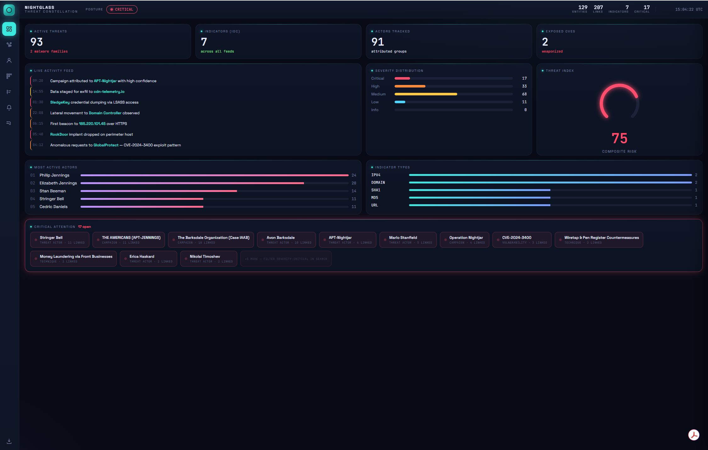 | 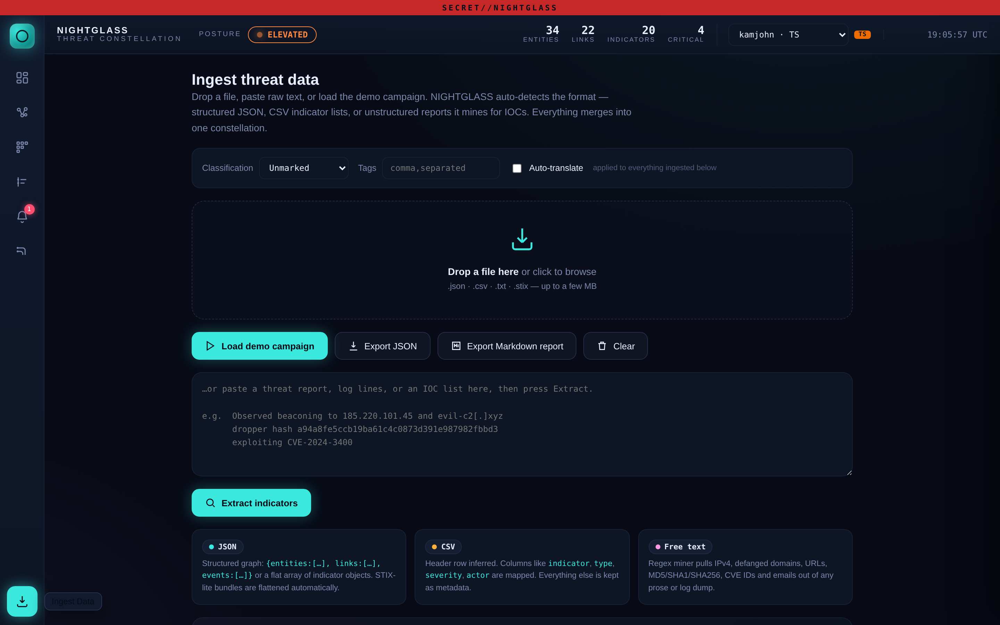 |
| 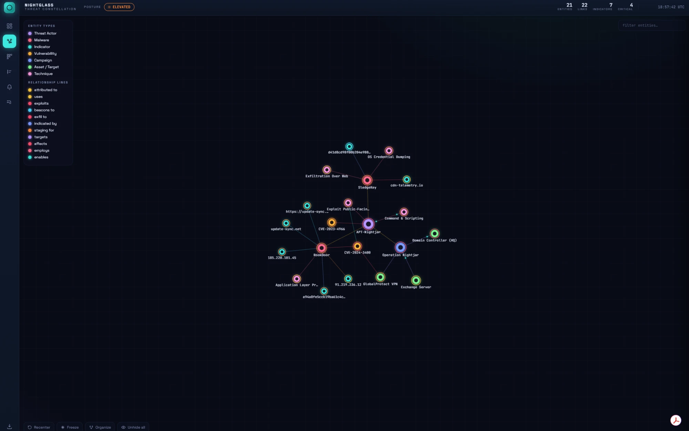 | 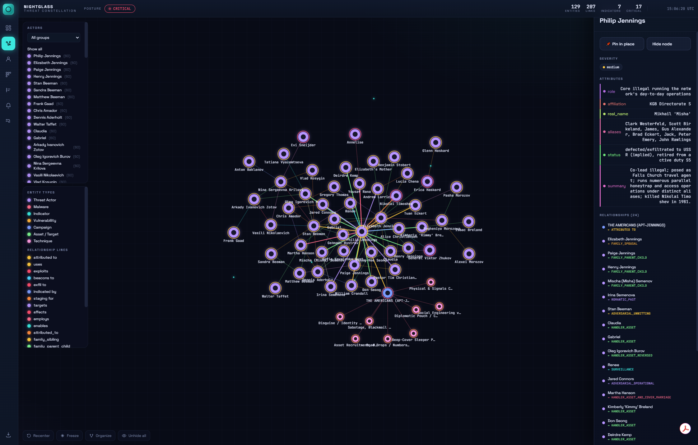 |
| 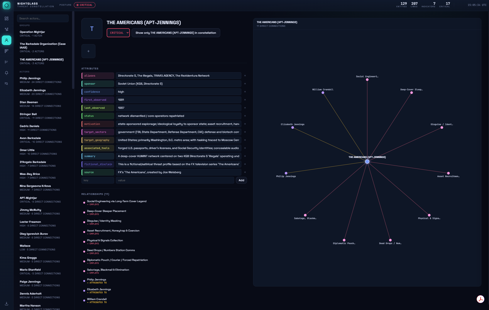 | 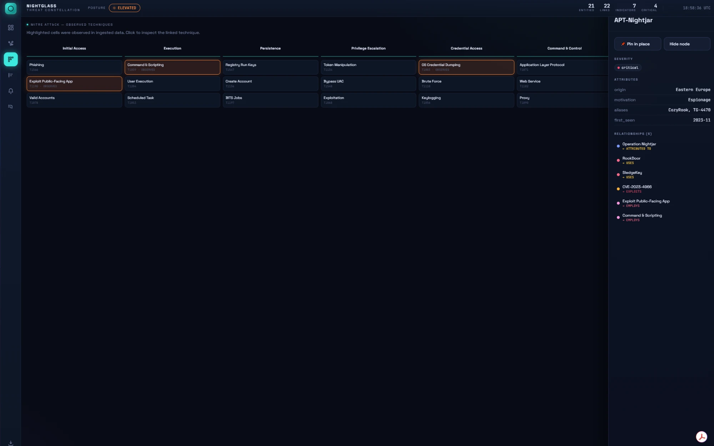 |
| 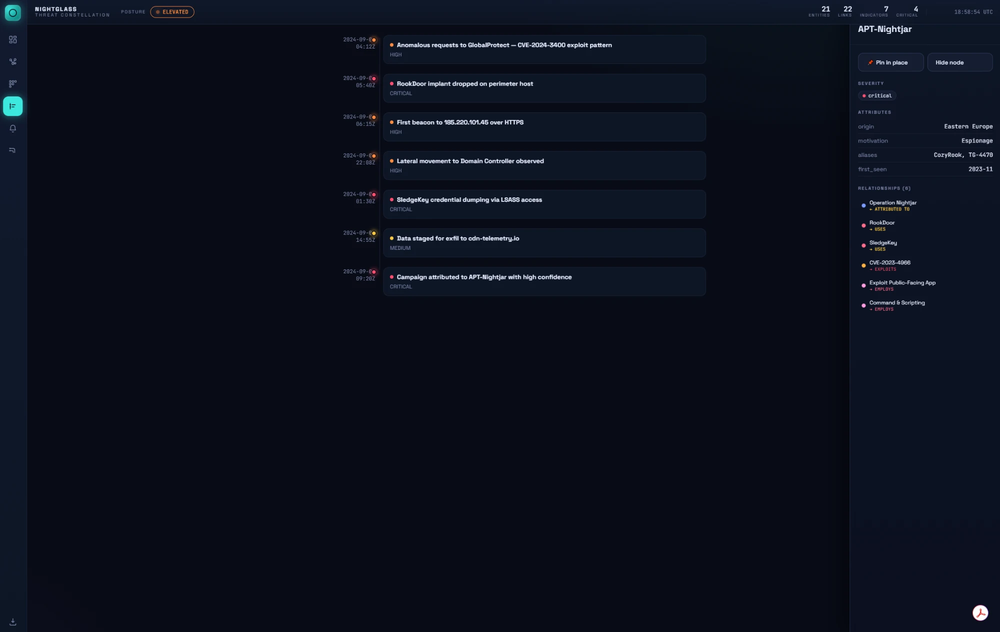 | 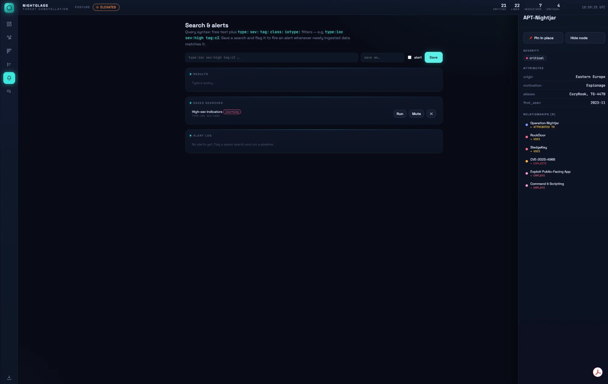 |
| 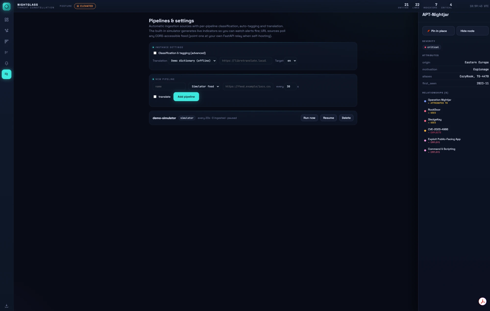 | 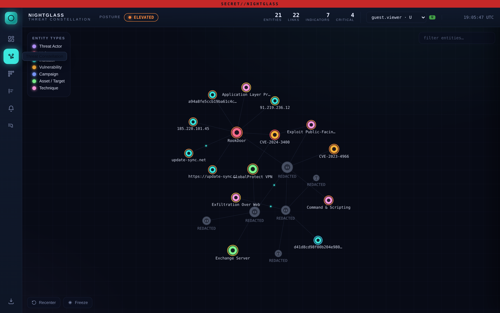 |

Hovering a relationship line surfaces what it is:

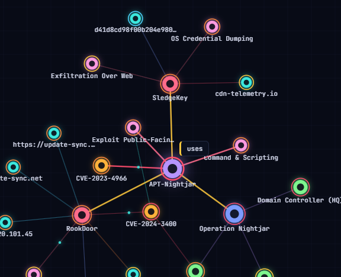

Classification markings and redaction are off by default (bottom-right above); the guest view shows the advanced-mode toggle switched on.

## Docs

- [`CLAUDE.md`](CLAUDE.md) — auto-loaded operational guide for Claude Code sessions (run/test commands, code map, conventions, guardrails, next tasks).
- [`HANDOFF.md`](HANDOFF.md) — full architecture and continuation notes for AI-assisted development sessions.
- [`wiki/`](wiki/) — Obsidian-compatible project wiki (copy into your vault, e.g. `E:\NIGHTGLASS-Wiki`).

## Status & roadmap

Frontend-only and in-memory by design (export/import JSON is the persistence loop). The planned backend follows the house stack — FastAPI + SQLAlchemy + SQLite, Tauri for desktop — with entities/links/events mapping 1:1 to tables. See [`wiki/Roadmap.md`](wiki/Roadmap.md).

## Security notes

This is an analysis tool for threat *data about* adversaries; it performs no scanning, exploitation, or contact with hostile infrastructure. Clearance-based redaction is an opt-in, client-side UX control — for real multi-user enforcement it must move server-side (see roadmap). Demo data is entirely fictional and ships unclassified/untagged by default.
